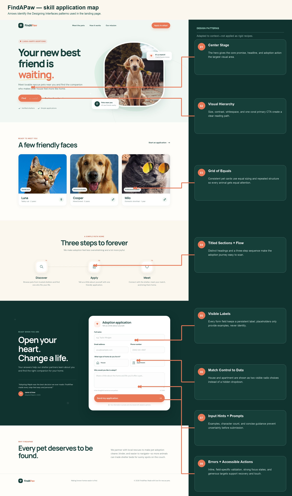

# FindAPaw

A responsive landing page for a fictional pet-adoption service. FindAPaw helps people discover rescue animals, understand the adoption process, and submit an adoption application from one focused page.



## Overview

The page is designed around one primary user goal: **start a pet-adoption application with confidence**. It combines an emotionally engaging introduction with clear process information and a short, accessible application form.

### Key features

- Responsive desktop, tablet, and mobile layouts
- Hero section with a clear primary call to action
- Equal-weight pet profile cards
- Three-step explanation of the adoption process
- Adoption application with visible labels and native form controls
- Client-side validation with specific inline error messages
- Character counter for the adoption message
- Keyboard-friendly focus management
- Accessible success state after submission
- Reduced-motion support

> [!NOTE]
> This is a front-end prototype. Submitting the form displays a local confirmation state; no application data is sent to a server or stored.

## Run locally

No build step or package installation is required.

Open `index.html` directly in a browser, or serve the directory locally:

```bash
python3 -m http.server 8000
```

Then visit [http://localhost:8000](http://localhost:8000).

The page loads its typefaces from Google Fonts and pet photography from Unsplash, so those visual assets require an internet connection.

## Project structure

| File | Purpose |
| --- | --- |
| `index.html` | Semantic page structure, content, navigation, and adoption form |
| `styles.css` | Design tokens, responsive layout, visual states, and accessibility styles |
| `script.js` | Form validation, character count, focus handling, and success/reset behavior |
| `findapaw-skill-annotations.png` | Annotated map of the interface patterns used in the page |

## Adoption form

The application asks only for information needed for an initial adoption inquiry:

- Full name
- Email address
- Phone number
- Home type: house or apartment
- A message explaining why the person wants to adopt

The form uses visible labels, appropriate `autocomplete`, `inputmode`, and input types, a 500-character limit, and actionable validation messages. Invalid submissions move keyboard focus to the first field that needs attention while preserving everything already entered.

---

# Nielsen’s 10 usability heuristics

The interface was reviewed against Jakob Nielsen’s ten general principles for interaction design. The heuristics are applied as design guidance rather than as rigid rules.

## 1. Visibility of system status

**Principle:** The interface should keep users informed about what is happening through timely, understandable feedback.

**How FindAPaw applies it:**

- Buttons, links, fields, and cards provide immediate hover or focus feedback.
- Invalid fields are identified beside the relevant control after blur or submission.
- The message field displays a live `0 / 500` character count.
- A successful submission replaces the form with a prominent **“Application sent!”** confirmation.
- Focus moves to the success panel, ensuring assistive-technology and keyboard users receive the state change.

**Prototype limitation:** There is no network request, so a loading indicator is unnecessary. A production submission should disable repeated submissions and display progress while waiting for the server.

## 2. Match between the system and the real world

**Principle:** Use familiar language, concepts, and ordering rather than internal system terminology.

**How FindAPaw applies it:**

- The page uses conversational language such as “Find your match,” “Meet,” and “Open your heart.”
- The application follows a natural introduction: identity, contact details, home type, then motivation.
- House and apartment choices use recognizable home icons and plain-language labels.
- The adoption process is explained as three familiar steps: **Discover → Apply → Meet**.
- Pet profiles use familiar information such as name, breed, age, and temperament.

## 3. User control and freedom

**Principle:** Users need clear ways to change their minds, recover, and leave an unwanted state.

**How FindAPaw applies it:**

- Navigation links let users move directly between pets, process information, mission, and application sections.
- Validation never clears the form; users can correct one field without re-entering the others.
- Radio choices can be changed at any time before submission.
- After the confirmation state, **“Submit another application”** resets and restores the form.
- The brand link provides an easy return to the top of the page.

**Production recommendation:** Before sending real data, consider a review step or an explicit confirmation if submission has legal or irreversible consequences.

## 4. Consistency and standards

**Principle:** Similar elements should look and behave consistently, and the interface should follow established platform conventions.

**How FindAPaw applies it:**

- Coral consistently identifies primary actions; dark green identifies headings and brand structure.
- Buttons share shape, weight, hover behavior, and minimum target size.
- Section titles follow one typography and spacing system.
- All fields use standard HTML labels, inputs, radio buttons, and a submit button.
- Focus outlines and error treatments are consistent across controls.
- Cards use the same image, title, metadata, and badge arrangement.

## 5. Error prevention

**Principle:** Prevent problems before they occur rather than relying only on error messages afterward.

**How FindAPaw applies it:**

- Required fields are represented by native form requirements and validated before confirmation.
- `type="email"` and `type="tel"` provide suitable browser and mobile-keyboard behavior.
- Phone validation accepts formatting characters while checking the underlying number of digits.
- Home type is constrained to two mutually exclusive radio choices.
- The adoption message has a visible character count and a hard 500-character maximum.
- Hints and examples clarify expected content before users make mistakes.

## 6. Recognition rather than recall

**Principle:** Keep options and instructions visible so users do not have to remember information from elsewhere.

**How FindAPaw applies it:**

- Form labels remain visible after users begin typing; placeholders are examples, not replacements for labels.
- House and apartment options are displayed simultaneously instead of hidden in a dropdown.
- The three-step adoption process remains visible as a complete sequence.
- Calls to action use descriptive labels rather than ambiguous text such as “Continue.”
- Input hints appear beside the field where they are needed.

## 7. Flexibility and efficiency of use

**Principle:** Support both first-time and experienced users, including accelerators that reduce effort.

**How FindAPaw applies it:**

- Anchor links let users skip directly to the content they need.
- Browser autofill is supported with `name`, `email`, and `tel` autocomplete tokens.
- Appropriate input modes reduce keyboard switching on mobile devices.
- The form follows a predictable tab order and can be submitted with the keyboard.
- The responsive layout changes from multi-column presentation to a mobile **Vertical Stack**.
- Large controls and generous spacing make touch interaction efficient.

## 8. Aesthetic and minimalist design

**Principle:** Every extra element competes with relevant information. Interfaces should prioritize what supports the user’s goal.

**How FindAPaw applies it:**

- The hero has one dominant promise and one primary action.
- The restrained palette uses dark green, coral, cream, and neutral supporting colors.
- The application contains only five initial-inquiry questions.
- Whitespace and proximity establish groups without excessive borders or decoration.
- Each page section has one clear purpose: discover, understand, apply, or learn about the mission.
- Secondary information is visually quieter than primary content and actions.

## 9. Help users recognize, diagnose, and recover from errors

**Principle:** Error messages should be expressed in plain language, identify the problem, and suggest a solution.

**How FindAPaw applies it:**

- Messages appear directly beneath the field that needs attention.
- Errors explain how to fix the problem, such as **“Enter an email like you@example.com.”**
- Phone errors state the accepted digit range.
- The adoption-message error states the minimum useful length.
- Error state is communicated with text and `aria-invalid`, not color alone.
- Focus moves to the first invalid field after an unsuccessful submission.
- Entered data remains intact during recovery.

## 10. Help and documentation

**Principle:** Even a simple interface may need concise, searchable, task-focused guidance.

**How FindAPaw applies it:**

- The **How it works** section explains the complete process before users apply.
- Field-level prompts provide help at the moment it is needed.
- The privacy note explains how application information would be shared.
- The confirmation state provides an expected response window of 2–3 days.
- Section navigation makes process guidance easy to revisit.

**Production recommendation:** Add shelter-specific eligibility requirements, contact information, privacy-policy details, and an adoption FAQ when connecting the page to real organizations.

---

## Supporting interface patterns

The page also uses named patterns from the *Designing Interfaces* pattern library:

- **Center Stage** for the hero and primary adoption message
- **Visual Hierarchy** through scale, contrast, position, and whitespace
- **Grid of Equals** for equally weighted pet profiles
- **Titled Sections** for scan-friendly content organization
- **Vertical Stack** for the mobile layout
- **Visible Labels**, **Input Prompts**, and **Input Hints** in the form
- **Match the Control to the Data** for the house/apartment radio choices
- **Error Messages** for specific, local, recoverable validation
- **Generous Borders** for touch-friendly controls and spacing

These patterns complement Nielsen’s heuristics: the patterns describe reusable interface solutions, while the heuristics provide broader principles for evaluating usability.

## Accessibility notes

- Semantic landmarks and headings provide a navigable document structure.
- Form controls are associated with visible labels.
- Decorative SVGs are hidden from assistive technology.
- Text and controls use visible keyboard focus indicators.
- Error states include text and programmatic attributes.
- Touch targets are designed around a minimum height of approximately 44 pixels.
- Body copy uses readable line height and restrained line length.
- `prefers-reduced-motion` minimizes transitions for users who request it.
- Responsive layouts avoid horizontal scrolling at supported viewport sizes.

## Future production work

- Connect form submission to a secure API or trusted form service.
- Add server-side validation and abuse protection.
- Add a pending state and retry behavior for network requests.
- Provide a complete privacy policy and data-retention explanation.
- Replace sample pets with shelter-managed data and detail pages.
- Test with screen readers, keyboard-only navigation, zoom, and real mobile devices.
- Run automated accessibility checks and conduct usability testing with prospective adopters.
